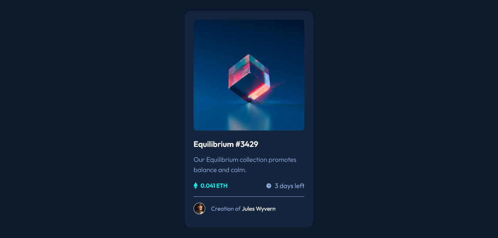

# Frontend Mentor - NFT preview card component solution

This is a solution to the [NFT preview card component challenge on Frontend Mentor](https://www.frontendmentor.io/challenges/nft-preview-card-component-SbdUL_w0U). Frontend Mentor challenges help you improve your coding skills by building realistic projects.

## Table of contents

- [Overview](#overview)
  - [The challenge](#the-challenge)
  - [Screenshot](#screenshot)
  - [Links](#links)
- [My process](#my-process)
  - [Built with](#built-with)
  - [What I learned](#what-i-learned)
  - [Continued development](#continued-development)
  - [Useful resources](#useful-resources)
- [Author](#author)

## Overview

### The challenge

Users should be able to:

- View the optimal layout depending on their device's screen size
- See hover states for interactive elements

### Screenshot



### Links

- Solution URL: [source code](https://github.com/SilvanosEric/nft-preview-card-component)
- Live Site URL: [website](https://silvanoseric.github.io/nft-preview-card-component/)

## My process

### Built with

- Semantic HTML5 markup
- Flexbox
- CSS Grid
- Mobile-first workflow
- [tailwindcss](https://tailwindcss.com/)
- [vite](https://vitejs.dev/)

### What I learned

Use this section to recap over some of your major learnings while working through this project. Writing these out and providing code samples of areas you want to highlight is a great way to reinforce your own knowledge.

- When an element has the display property explicitly set to a particular value, and we need to hide it, using the same display property, doing so may cause issues, since the previous display property gets ignored for the newer value.

- To hide an element with a display property already set, it would be much more feasible to consider using the visibility property.

- An element can only be centered in relation to the screen, if and only if the preceding parent spans the entire viewport, .i.e inline and block

```html
<div class="container">
  <div></div>
</div>
```

```css
.container {
  background-color: teal;
  width: 100vw;
  height: 100vh;
  display: grid;
  place-items: center;
}

.container div {
  width: 100px;
  height: 100px;
  background-color: orange;
}
```

- **Note**: The universal selector was used to remove the default margin assigned to elements by browsers (user agents). Removing this default margin prevents side scrolling

- **Note**: When you have only one item as the immediate child of the container, this approach will work just fine. In th event the parent container has more than one child element you will have to use the following css property

```css
.container {
  background-color: teal;
  width: 100vw;
  height: 100vh;
  display: grid;
  place-content: center;
}
```

- **Note**: There are othe alternatives to centering other than using css grid.

### Continued development

- [Introduction to the DOM](https://developer.mozilla.org/en-US/docs/Web/API/Document_Object_Model/Introduction)

### Useful resources

- [A brief introduction to Opacity and RGBA](https://www.css3.info/introduction-opacity-rgba/) - The article focuses mainly on the RGBA color pattern, although the information can just as well be applied to the other color formats. This will hold true as long as the color format supports the alpha channel.

## Author

- Frontend Mentor - [@SilvanosEric](https://www.frontendmentor.io/profile/SilvanosEric)
